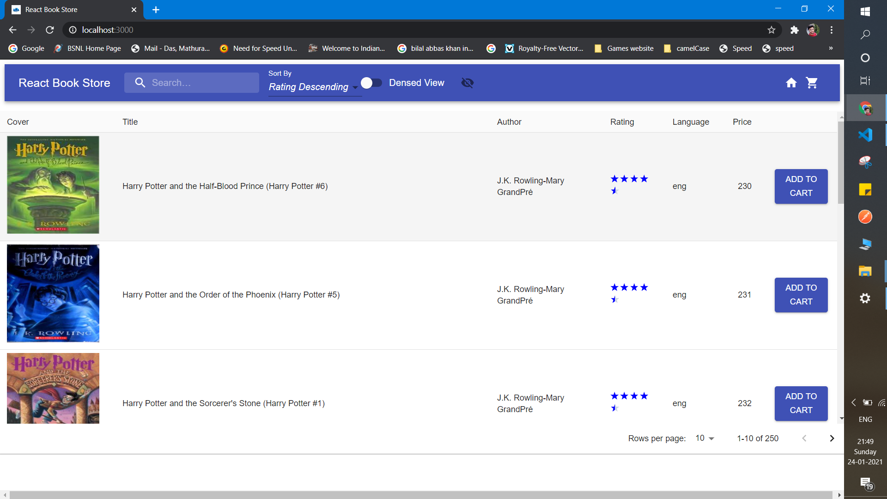
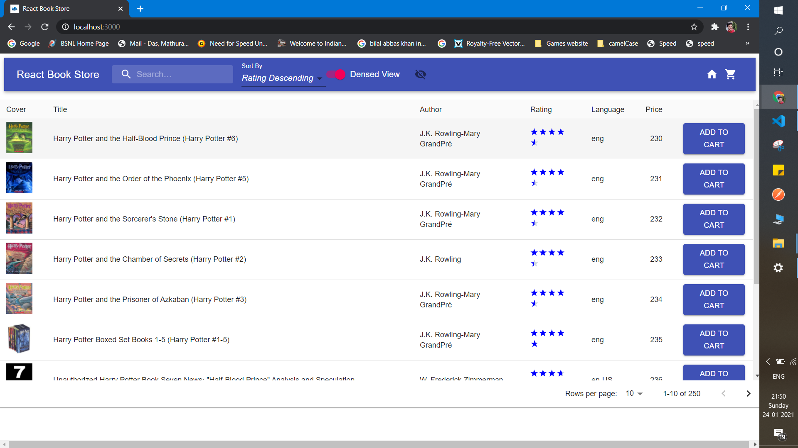
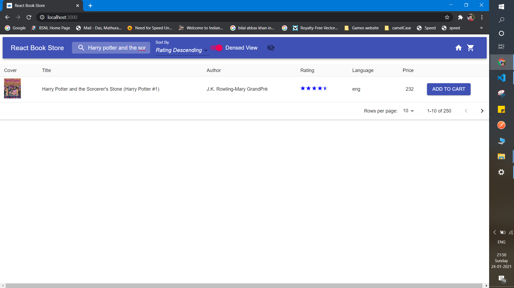
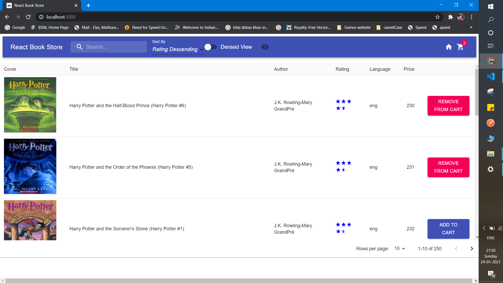
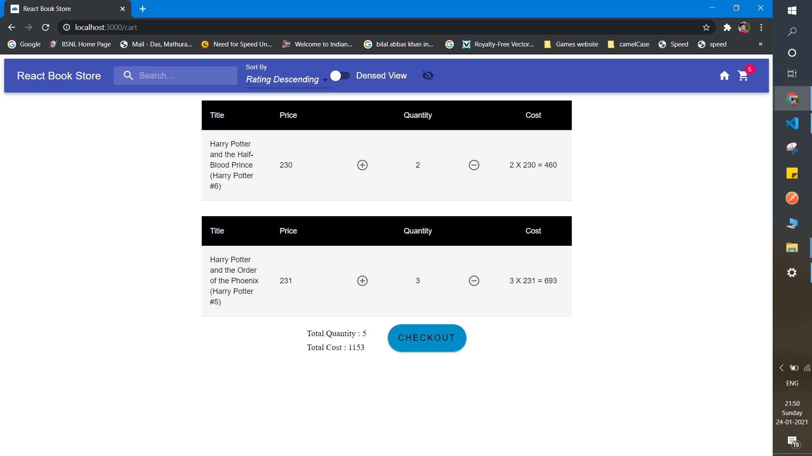
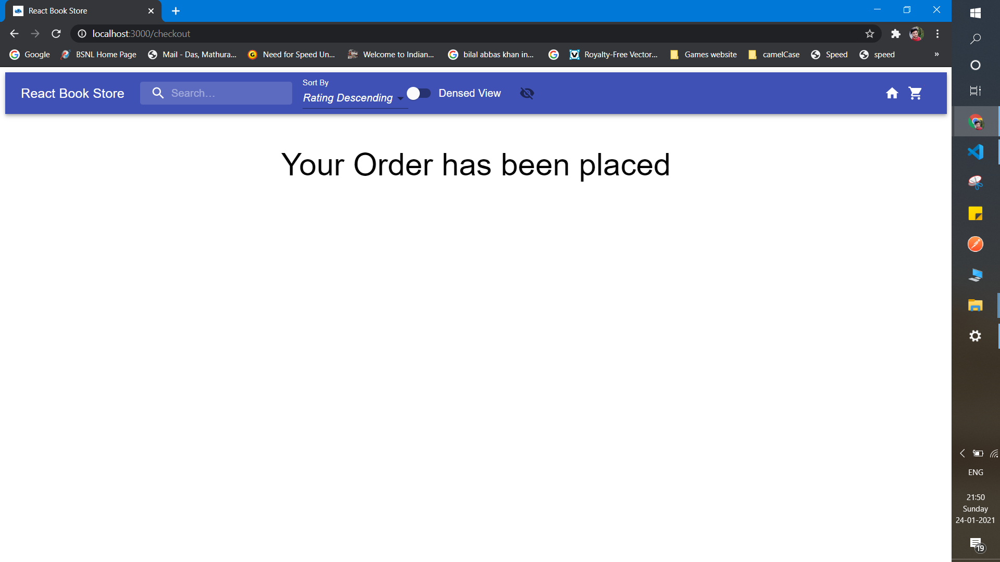

# ECSTest

# React Book Store

### To run locally go to bookstrore folder by `cd bookstore` then do `npm install` for installing dependencies and then `npm start` to start the project in local server

#### `npm start`

Runs the app in the development mode.\
Open [http://localhost:3000](http://localhost:3000) to view it in the browser.

The page will reload if you make edits.\
You will also see any lint errors in the console.

###  For deployement first run `npm run build` in bookstore folder

#### `npm build`

Builds the app for production to the `build` folder.\
It correctly bundles React in production mode and optimizes the build for the best performance.

The build is minified and the filenames include the hashes.\
Your app is ready to be deployed!

